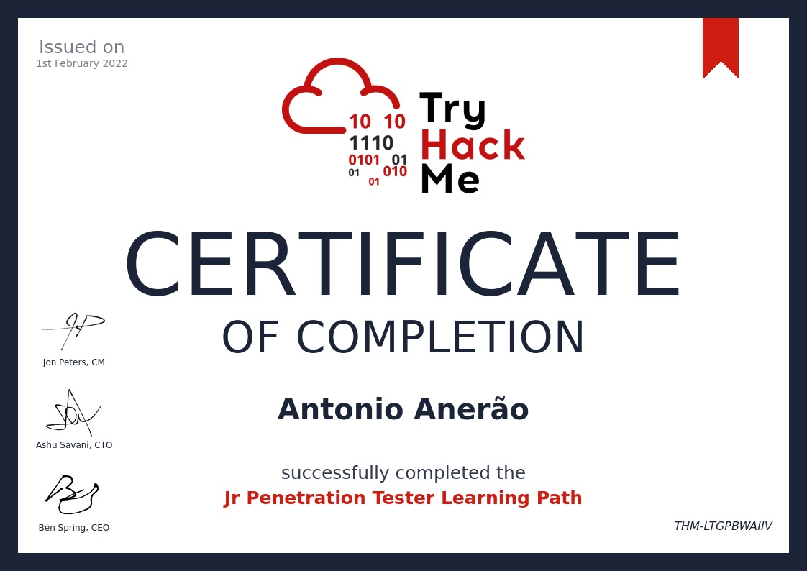

I'm a Web Developer and student of Cybersecurity, currently as a Software Developer Coordinator at Ministério Público Do Estado do Acre where I manage a small but awesome team.

  ---

Skills: PHP / Laravel / WordPress / WooCommerce / SQL / GNU/Linux / Linux Server /  Docker / Traefik / Oracle Cloud Architect Professional / Team Management / Code Review

  ---

### Certifications

     

  ---
  
   
