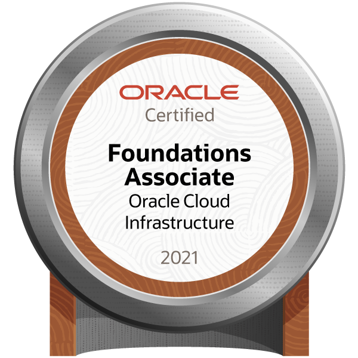

<h1 align="center">Hi , My name is Antonio</h1>
<h3 align="center">Software Developer Coordinator</h3>

A programmer since 2012, in love with Laravel and WordPress. I am currently the Software Development Coordinator at Ministério Público Do Estado Do Acre, in Brazil.

Skills: PHP / Laravel / WordPress / WooCommerce / Python / SQL / GNU/Linux / Docker / Oracle Cloud Architect

### Certifications

 
